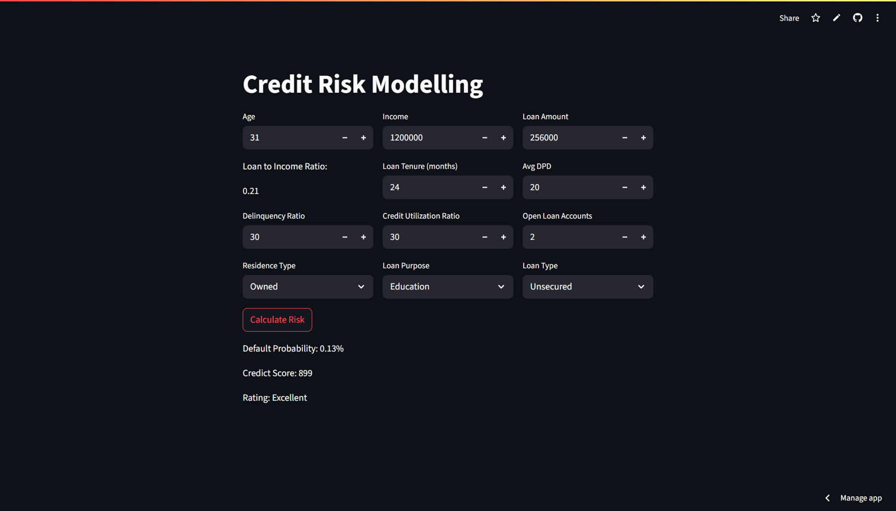

# Project Report 

---
## Credit Risk Modelling App

Built a streamlit app that automates the process of credit risk evaluation with the help of machine learning algorithm.
This app is designed for loan processing officer to check applicant's credit worthiness for the applied loan.
It takes parameters like applicant's income, applied loan,type of loan,  previous credit history like applicant's delinquency rate, open loan accounts etc. then returns the risk associated with the loan. 

---
## Features 

- Simple and clean UI of Streamlit.
- Predicts risk associated with the loan 
- Provides the applicants credit score
- Categorizes applicants into risk tiers: Poor (300–499), Average (500–649), Good (650–749), Excellent (750–900)
- Input Features: 
    - Applicant's age, Loan amount, Income
    - Loan tenure months, Average DPD, Delinquency ratio
    - Credit Utilization ratio, Open Loan Accounts
    - Residence type, Loan Purpose, Loan type
- Backend model trained on Logistic Regression.
- Also provides information like credit utilization ratio.
- Model's quality tracked using AUC, Gini, KS and recall.
- AI explainability, provides coefficients which can help business to do future enhancements.

---
## Tech Stack
- **Frontend**: Streamlit
- **Backend**: Python, Pandas, NumPy, Scikit-learn, xgboost, Fastapi
- **Deployment**: Streamlit Cloud
- **Model**: Logistic Regression & XGB Classifier

---
## Project Structure
``` text
ml-project-credit-risk-modelling/
│
├── artifacts/                  # Saved ML artifacts (model)
│   ├── model_data.joblib       #model in joblib
│
├── backend/                    # FastAPI server code (alternative API-based version)
│   ├──logging_setup.py         #logging setup
│   ├──prediction.py            #model backend
│   ├──server_cr.py             #fastapi backend
│    
├── main.py                     # Streamlit app (direct integration, deployed on Streamlit Cloud)
├── requirements.txt            # Python dependencies
├── LICENSE                     # Apache 2.0 license
└── README.md                   # Project documentation
```


---
## How to run locally

1. Clone the repo:
``` bash
git clone https://github.com/itsmoksh/ml-project-credit-risk-modelling.git
cd ml-project-credi-risk-modelling
```
2. Install Dependencies:
``` bash
pip install -r requirements.txt
```
3. Run the app:
``` bash
streamlit run main.py
```
---
## Streamlit Screenshots


This applicant is demanding more loan relative to income, increasing loan to income ratio and has more delinquent ratio too. Resulting to be a defaulter and poor credit score.


Loan to income ratio is less which is the major predictor, therefore applicant found
to have low default and excellent credit score.

--- 
## Live App

Check out the **live demo**:  
[Streamlit Cloud Link](#) *(https://moksh-credit-risk-modelling-project.streamlit.app/)*

##  Author

**Moksh Jain**  
Aspiring Data Scientist | Python & ML Enthusiast  
[LinkedIn](https://www.linkedin.com/in/itsmoksh/) • [GitHub](https://github.com/itsmoksh)
  


